https://github.com/user-attachments/assets/58959673-3edf-4916-bc87-8a22b4413e70
# CodePulse

A full-stack MERN application for tracking Data Structures & Algorithms interview preparation — log problems, track topic mastery, set daily goals, and get AI-personalized study plans.

> 🚀 **Live Demo:** [code-pulse-lime.vercel.app](https://code-pulse-lime.vercel.app)
> 📄 **API Documentation:** [`docs/API-Documentation.pdf`](docs/API-Documentation.pdf)
> 🧪 **Postman Collection:** [`docs/CodePulse-Postman-Collection.json`](docs/CodePulse-Postman-Collection.json)

---

## 1. Overview

CodePulse helps students and job-seekers structure their DSA interview preparation in one place. Instead of relying on scattered notes, spreadsheets, and problem lists, CodePulse allows users to:
* Track DSA topics and problems
* Monitor topic-wise mastery
* Identify genuinely weak topics
* Set and track daily solving goals
* Flag topics and problems for revision
* Generate AI-powered study plans based on actual progress

---

## 2. Problem Statement

Most DSA preparation trackers either function as simple problem lists or spreadsheets with limited analytics. They do not provide enough insight into **which topics a learner is actually weak in**, nor do they personalize the preparation plan according to the learner's progress. As a result, students may spend too much time revising topics they already understand while neglecting topics that need more attention.

---

## 3. Solution

CodePulse combines problem tracking with analytics and AI-based personalization. The application calculates a difficulty-weighted mastery score for each topic and uses that information to identify weak areas. These weak topics are then used to generate a personalized AI study plan through Google Gemini. This creates a continuous preparation workflow:

Log Problems
     ↓
Track Topic Progress
     ↓
Calculate Mastery
     ↓
Identify Weak Topics
     ↓
Generate AI Study Plan
     ↓
Practice & Improve

---

## 4. Key Features

### Authentication

* OTP-based email registration
* JWT-based authentication
* Google OAuth 2.0
* Password hashing using bcrypt
* Forgot/reset password functionality
* Rate limiting on sensitive authentication endpoints

### Topic & Problem Tracking

* Create, update, and delete topics
* Create, update, and delete problems
* Associate problems with topics
* Difficulty classification
* Problem notes and approaches
* Search, filtering, sorting, and pagination
* Revision flags

### Dashboard Analytics

* Total topics and problems
* Solved problem statistics
* Difficulty-wise problem distribution
* Topic-wise mastery scores
* Weak-topic detection
* Revision topics and problems
* Weekly activity insights

### Daily Goal Tracker

* Set daily problem-solving targets
* Track achieved progress
* Color-coded calendar
* Upcoming, completed, and missed goal states
* Monthly goal history

### AI Study Plan

* Personalized study plans using Google Gemini (`gemini-flash-latest`)
* Plans based on weak topics detected from dashboard analytics
* Day-by-day study recommendations
* Study-plan progress tracking
* Regeneration support with rate limiting
* Automatic retry handling for temporary AI-provider failures

### Profile Management

* Update profile information
* Profile photo upload
* Cloudinary-based image storage

### Help & Support

* Contact support
* Submit bug reports
* Request new features

### Responsive Design

* Desktop
* Tablet
* Mobile

---

## 5. Core Concepts

### 5.1 Topic Mastery Score

CodePulse uses a difficulty-weighted scoring system:

| Difficulty | Points |
| ---------- | ------ |
| Easy       | 1      |
| Medium     | 2      |
| Hard       | 3      |

The mastery score is calculated as:

Mastery Score = (Easy × 1) + (Medium × 2) + (Hard × 3)

A topic is classified as **Weak** when:

Mastery Score < 7

Topics with no qualifying problems are simply excluded from the weak-topics list entirely — this is independent of the topic's own status field (Not Started / In Progress / Done), which the user sets manually.

#### Example

| Problems                   | Calculation | Score | Status |
| -------------------------- | ----------- | ----- | ------ |
| 2 Easy                     | 2 × 1       | 2     | Weak   |
| 1 Easy + 2 Medium + 1 Hard | 1 + 4 + 3   | 8     |Not Weak|
| 3 Medium                   | 3 × 2       | 6     | Weak   |

Note: 'Weak' is the only classification the system formally returns (masteryScore < 7) — 'Not Weak' above is just for illustration, not a literal API status value.
This approach prevents topics with no activity from being incorrectly classified as weak while giving greater weight to harder problems.

---

### 5.2 AI Study Plan Generation

The AI study plan is generated using weak-topic information detected by the dashboard. The client obtains weak topics from dashboard analytics, extracts the topic names, and forwards them to the AI study-plan endpoint.

Dashboard
    ↓
Weak Topics
    ↓
Extract Topic Names
    ↓
AI Study Plan Request
    ↓
Google Gemini
    ↓
Personalized Study Plan

Users do not manually enter their weak topics. The current AI integration uses Google Gemini's `gemini-flash-latest` model.

---

### 5.3 Daily Goal Logic

The Daily Goal calendar distinguishes between:

* **Upcoming** — future dates
* **Completed** — goal achieved
* **Missed** — past goal that was not completed
* **In Progress** — current goal with partial progress
* **No Goal** — no goal configured for that date

Future dates are never marked as missed.

---

## 6. Technical Highlights

Some of the main technical decisions and challenges addressed in CodePulse include:

* Designed a **difficulty-weighted mastery system** to identify weak DSA topics using actual problem-solving data.
* Implemented **JWT authentication, Google OAuth 2.0, and OTP-based registration**.
* Added **rate limiting** to sensitive authentication and AI-generation endpoints.
* Integrated **Google Gemini (`gemini-flash-latest`)** for personalized study-plan generation based on dashboard-derived weak topics.
* Added retry handling for temporary AI-provider failures.
* Used **MongoDB TTL-based expiry** for temporary OTP records.
* Integrated **Cloudinary** for profile image storage.
* Used protected backend APIs so external-service credentials remain server-side.

---

## 7. Tech Stack

| Category            | Technologies                                      |
| ------------------- | ------------------------------------------------- |
| Frontend            | React, Tailwind CSS, Axios, Context API, Recharts |
| Backend             | Node.js, Express                                  |
| Database            | MongoDB, Mongoose                                 |
| Authentication      | JWT, Passport.js, Google OAuth 2.0, bcrypt        |
| AI                  | Google Gemini (`gemini-flash-latest`)             |
| Image Storage       | Cloudinary                                        |
| Email               | MailerSend                                        |
| Validation          | express-validator                                 |
| Rate Limiting       | express-rate-limit                                |
| API Testing         | Postman                                           |
| Frontend Deployment | Vercel                                            |
| Backend Deployment  | Render                                            |
| Database Hosting    | MongoDB Atlas                                     |

---

## 8. System Architecture

                    ┌─────────────────────┐
                    │   React Frontend    │
                    │   + Tailwind CSS    │
                    └──────────┬──────────┘
                               │
                             Axios
                               │
                               ▼
                    ┌─────────────────────┐
                    │ Node.js + Express   │
                    │      REST API       │
                    └──────────┬──────────┘
                               │
                  ┌────────────┼────────────┐
                  │            │            │
                  ▼            ▼            ▼
              MongoDB       Auth        Business
              + Mongoose    Middleware    Logic
                               │
                               ▼
                    ┌─────────────────────┐
                    │   External Services │
                    ├─────────────────────┤
                    │ Google OAuth        │
                    │ Google Gemini       │
                    │ Cloudinary          │
                    │ MailerSend          │
                    └─────────────────────┘

The frontend communicates with external services through the Express backend. Credentials and API keys remain on the server side.

---

## 9. Project Structure

CodePulse/
│
├── client/
│   └── src/
        ├── assets/
│       ├── components/
│       ├── pages/
│       ├── context/
│       └── services/
│
├── server/
│   ├── config/
│   ├── controllers/
│   │   ├── authController.js
│   │   ├── dashboardController.js
│   │   ├── problemController.js
│   │   ├── topicController.js
        ├── goalController.js
        ├── profileController.js
│   │   └── aiController.js
│   ├── middleware/
│   ├── models/
│   │   ├── User.js
│   │   ├── Topic.js
│   │   ├── Problem.js
│   │   └── StudyPlan.js
│   ├── routes/
│   └── utils/
│
├── docs/
│   ├── API-Documentation.pdf
│   ├── CodePulse-Postman-Collection.json
│   └── Screenshots/
│
├── README.md
├── PRD.md
└── LICENSE

---

## 10. Getting Started

### Prerequisites

Make sure the following are installed/configured:

* Node.js 18+
* npm
* MongoDB / MongoDB Atlas
* Google OAuth credentials
* Google Gemini API key
* Cloudinary account
* MailerSend account with an API key

### Clone the Repository

git clone https://github.com/varinda-Aggarwal/CodePulse.git
cd CodePulse

### Install Dependencies

#### Backend

cd server
npm install

#### Frontend

cd ../client
npm install

---

## 11. Environment Variables

> **Never commit `.env` files, API keys, passwords, or other secrets to GitHub.**

Create `.env` files using the provided `.env.example` templates.

### Backend

PORT=5000
MONGO_URI=your_mongodb_connection_string
JWT_SECRET=your_jwt_secret

GOOGLE_CLIENT_ID=your_google_client_id
GOOGLE_CLIENT_SECRET=your_google_client_secret
GOOGLE_CALLBACK_URL=http://localhost:5000/api/auth/google/callback

CLOUDINARY_CLOUD_NAME=your_cloudinary_cloud_name
CLOUDINARY_API_KEY=your_cloudinary_api_key
CLOUDINARY_API_SECRET=your_cloudinary_api_secret

EMAIL_USER=your_support_inbox_email

MAILERSEND_API_KEY=your_mailersend_api_key
MAILERSEND_SENDER_EMAIL=your_mailersend_sender_email

FRONTEND_URL=http://localhost:3000

GEMINI_API_KEY=your_gemini_api_key
NODE_ENV=development

Use the exact variable names present in the project's `.env.example` files.

### Frontend

Create the frontend `.env` according to the variable defined in:

client/src/services/api.js

The frontend API base URL should point to the running backend.

---

## 12. Running the Application

### Start Backend

From the `server` directory:

npm run dev

### Start Frontend

From the `client` directory:

npm start

During local development, the frontend and backend run on their configured local ports.

---

## 13. API Documentation

CodePulse provides **30 REST API endpoints** covering:

* Authentication
* Topics
* Problems
* Dashboard analytics
* Daily goals
* Profile management
* Help & Support
* AI Study Plans

The APIs have been manually tested using Postman.

### Complete API Documentation

[View API Documentation](docs/API-Documentation.pdf)

The PDF contains:

* Endpoint descriptions
* HTTP methods
* Authentication requirements
* Request parameters
* Request bodies
* Response examples
* Error responses
* Rate limits
* AI study-plan behavior

---

## 14. Postman Collection

A ready-to-import Postman collection containing the CodePulse API endpoints is included in the repository. The collection can be used to test:

* Authentication
* CRUD operations
* Dashboard APIs
* Goals
* Profile APIs
* Support APIs
* AI Study Plan APIs
* Authorization and validation errors

### Postman Collection

[Open CodePulse Postman Collection](docs/CodePulse-Postman-Collection.json)

---

## 15. Screenshots

The following screenshots showcase the main CodePulse features and user flows.

**1. Landing Page**

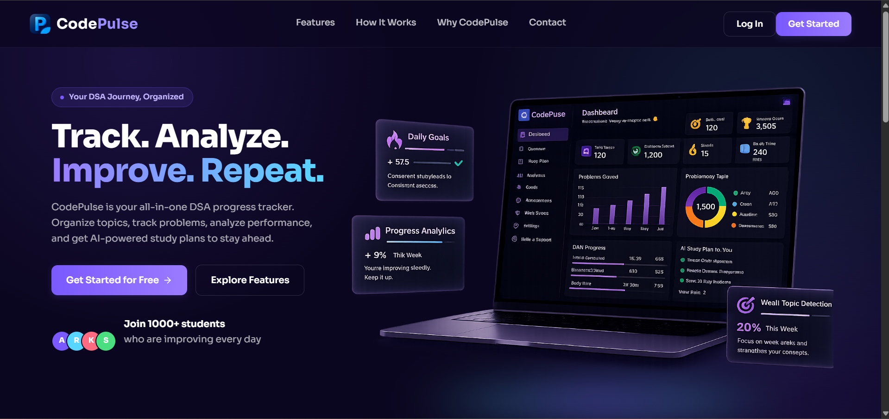

 

**2. Landing Page – Feature View**

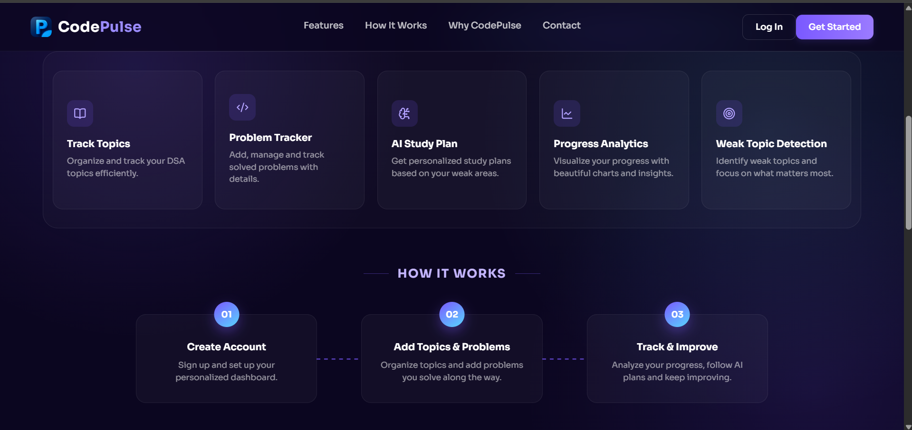

 

**3. Login**

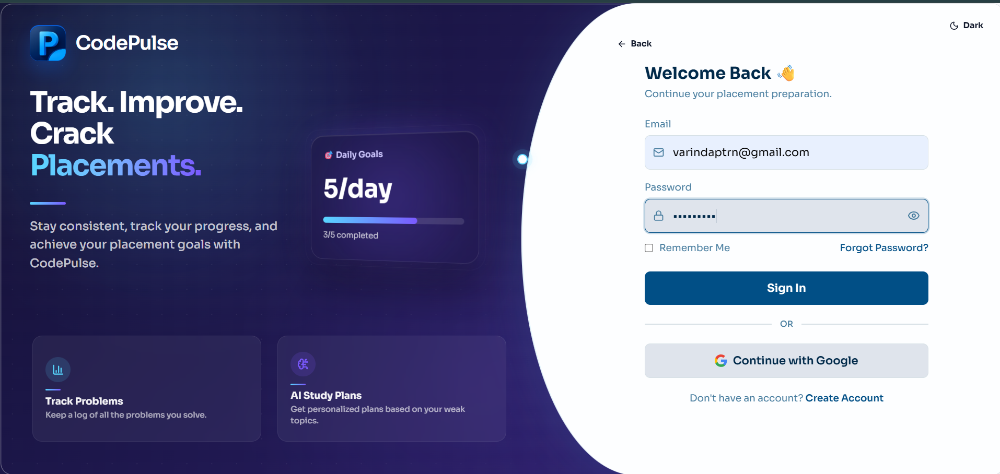

 

**4. Signup**

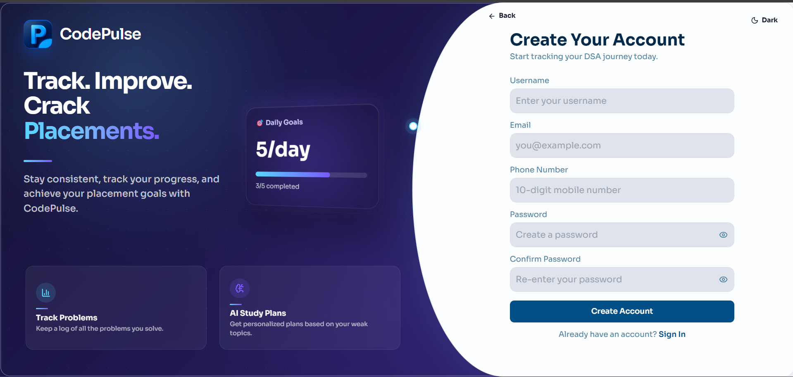

 

**5. Dashboard Overview**

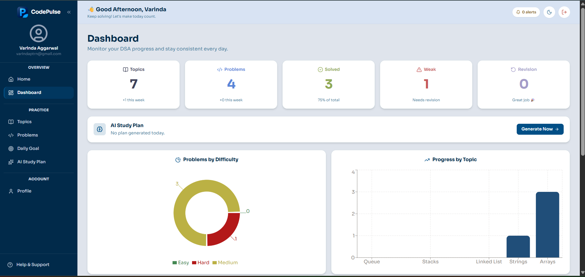

 

**6. Dashboard Analytics**

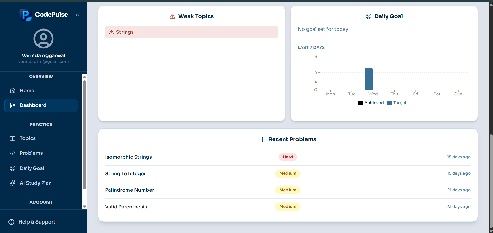

 

**7. Topics**

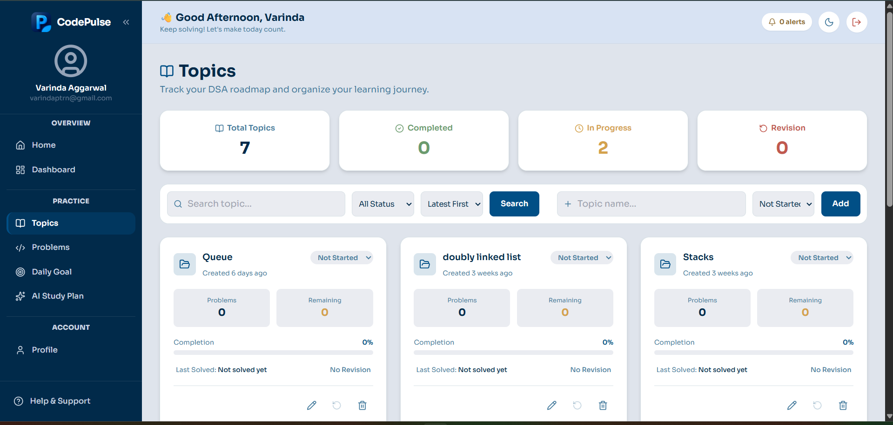

 

**8. Add Problem**

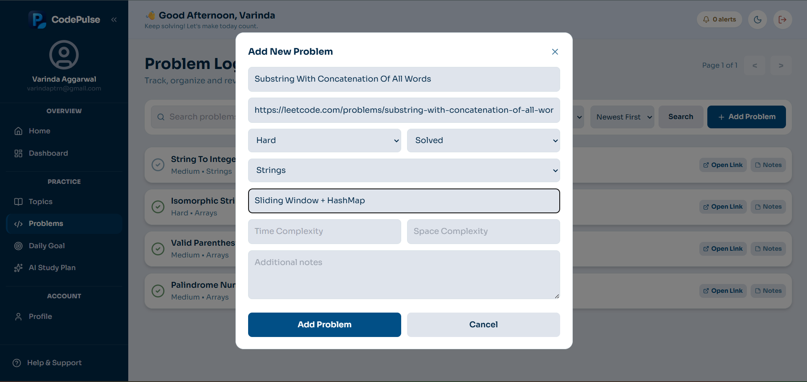

 

**9. All Problems**

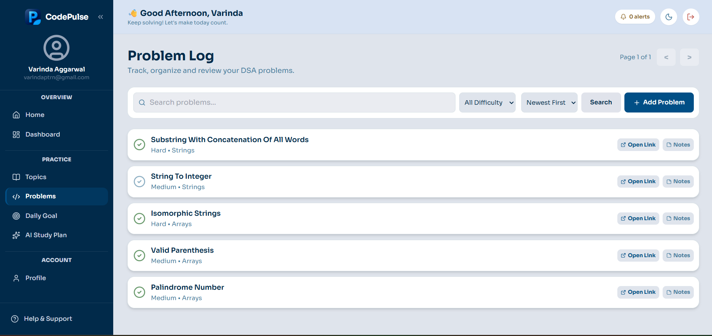

 

**10. AI Study Plan**

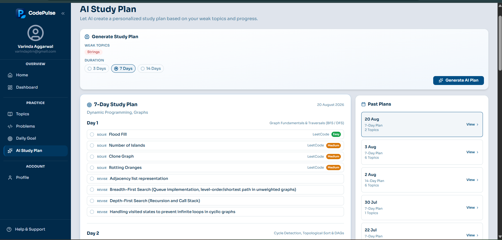

 

**11. Daily Goals**

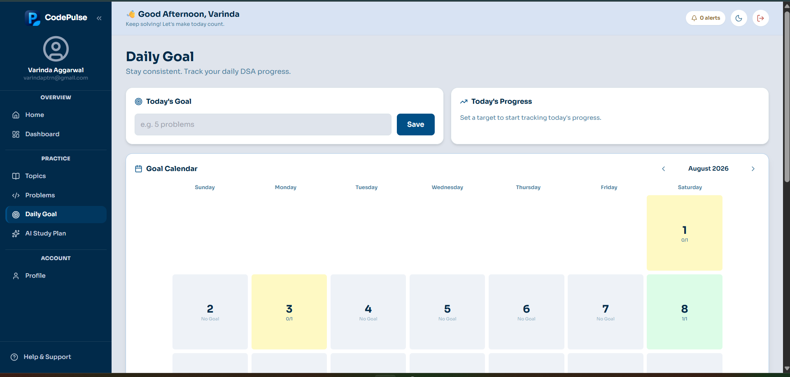

 

**12. Profile**

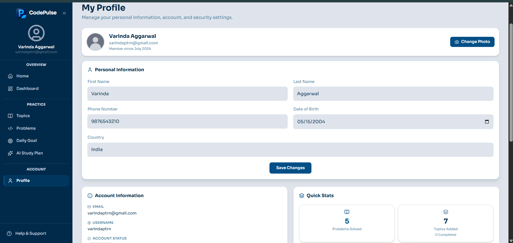

 

**13. Profile Details**

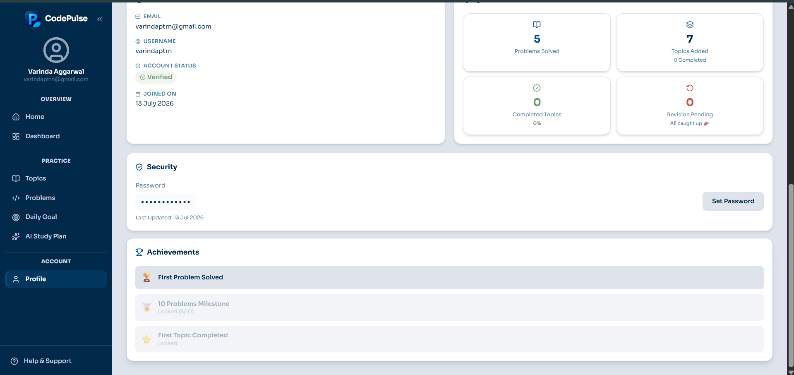

 

**14. Contact Us**

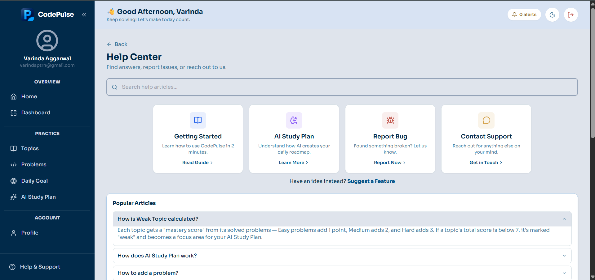

 

**15. Report a Bug**

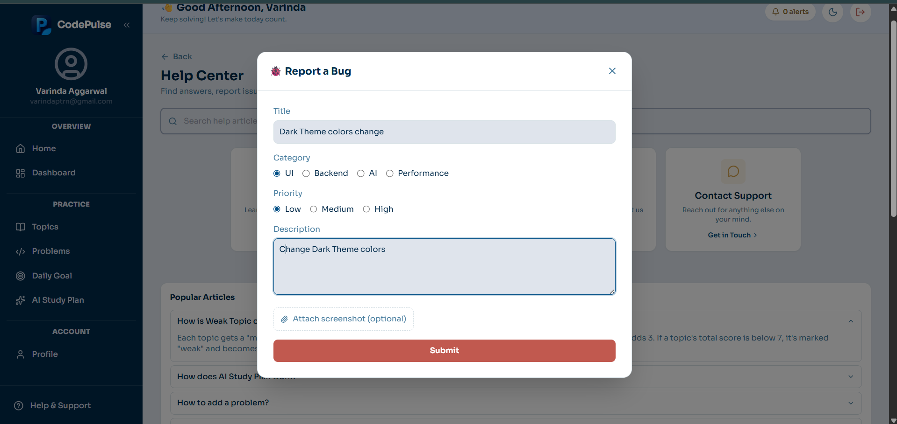

 

**16. Bug Report Email**

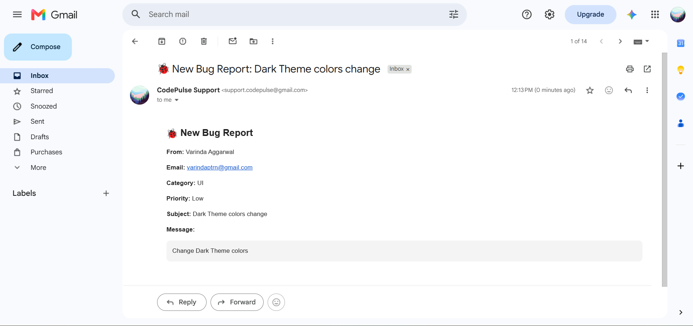

 

**17. Password Reset Email**

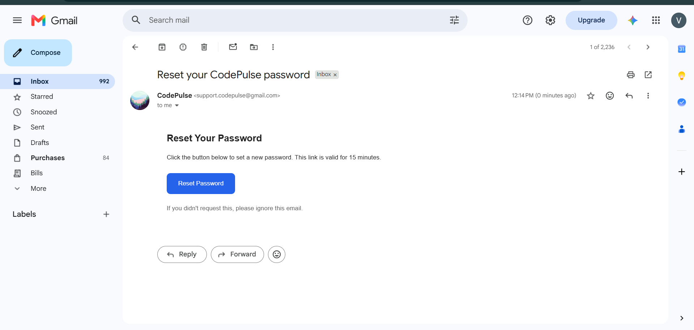

### AI Study Plan Demo

The following video demonstrates the AI Study Plan generation flow, from identifying weak topics to generating a personalized study plan using Google Gemini.

https://github.com/user-attachments/assets/a2ed1756-790c-48db-8c6c-83f30384401c

---

## 16. Testing

All 30 API endpoints have been manually tested using Postman.

### Testing Covered

* Happy-path API requests
* Authentication failures
* Authorization and ownership checks
* Validation errors
* Invalid requests
* Rate limiting
* AI-provider failure handling
* CRUD operations
* Dashboard calculations
* Daily goal behavior

End-to-end testing has been performed against the deployed application (Vercel frontend + Render backend), covering authentication (OTP signup, login, Google OAuth, password reset), CRUD flows, dashboard analytics, and AI study plan generation was also tested, but its availability may be affected by temporary Google Gemini service overload. Automated backend testing using Jest and Supertest is planned as a future enhancement.

---

## 17. Deployment

The deployment architecture is:

| Layer    | Platform      |
| -------- | ------------- |
| Frontend | Vercel        |
| Backend  | Render        |
| Database | MongoDB Atlas |

### Live Application

[https://code-pulse-lime.vercel.app](https://code-pulse-lime.vercel.app)

### Backend API

[https://codepulse-646c.onrender.com](https://codepulse-646c.onrender.com) — free-tier instance, may take 30–50 seconds to wake up after inactivity.

---

## 18. Known Limitations

* Google-linked accounts currently do not have a separate password-setting flow.
* Automated backend test coverage has not yet been implemented.
* Email delivery (OTP, password reset, support tickets) currently runs on a MailerSend trial account, which can only send to the account owner's verified email until a custom domain is authenticated — a signup with a different email will not receive its OTP yet.
* Dark mode is implemented and toggleable, but its color palette needs refinement.

---

## 19. Future Enhancements

* Finalize and improve dark theme support
* Automated backend testing with Jest and Supertest
* Spaced-repetition scheduling for revision-focused problems
* Public profile/progress sharing
* Progress export and reporting
* Additional analytics and personalization

---

## 20. Contributing

CodePulse is currently maintained as a personal portfolio project. Feedback, suggestions, and issue reports are welcome through GitHub Issues.

---

## 21. Author

**Varinda Aggarwal**

B.Tech CSE, Chitkara University

* [LinkedIn](https://www.linkedin.com/in/varinda-aggarwal-537101308/)
* [GitHub](https://github.com/varinda-Aggarwal/)

---

## 22. License

This project is licensed under the MIT License.

 See the [LICENSE](LICENSE) file for details.
